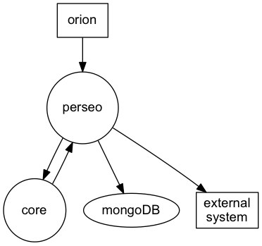
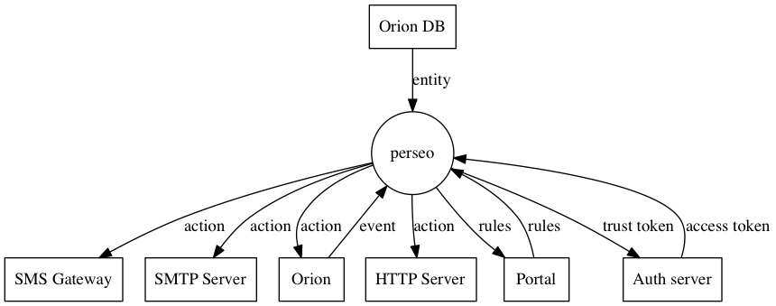
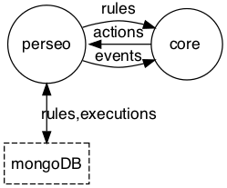
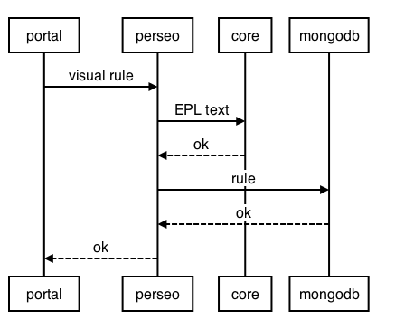
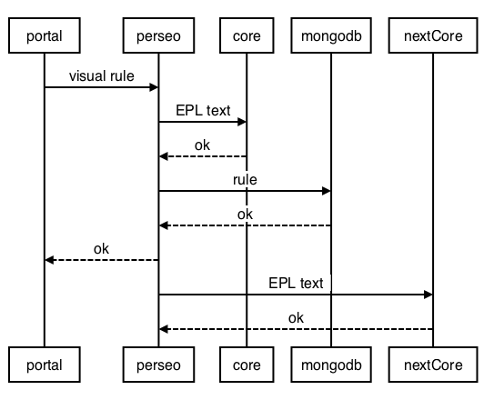
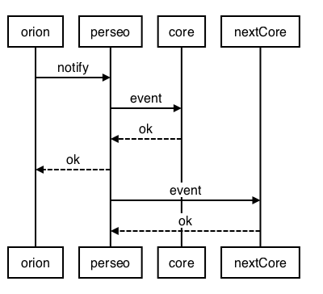
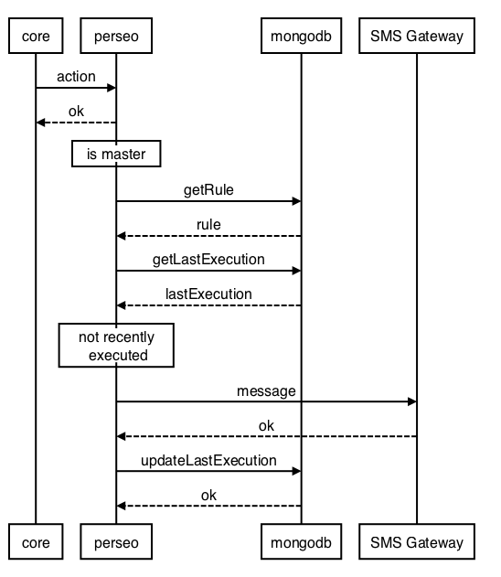
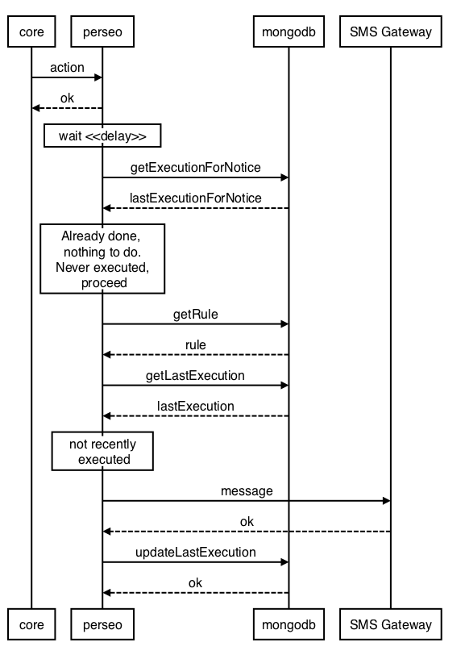
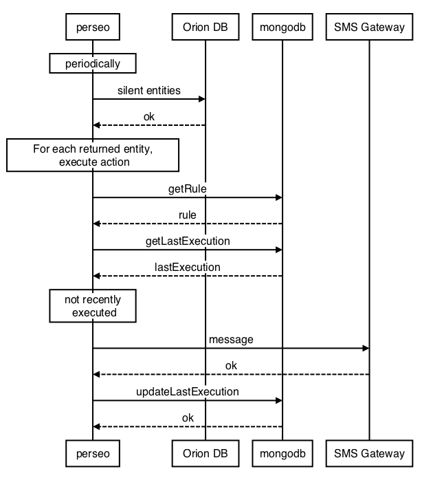
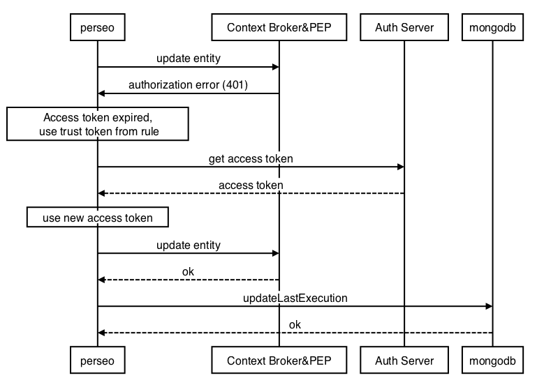

<a name="overview"></a>
# Architecture
* [Components](#Components)
* [Concepts](#Concepts)
* [Data flow](#Dataflow)
* [Scenarios](#Scenarios)

<a name="Components"></a>
## Components

### perseo

The CEP "front-end", it is in charge of processing incoming events and rules, storing rules and executing actions. Execution of actions are recorded for controlling frecuency of the actions performed. Also, it checks the no-update ("no-signal") rules which set a maximum time interval  between events from a context broker entity.

### core (perseo-core)

The CEP "back-end", the "rule-engine". It checks incoming events against rules in EPL and invokes perseo if an action must be executed. It has no pesistent storage. Rules are kept in memory. The whole set of rules is refreshed periodically by perseo "FE".

### mongoDB
Database used by perseo for storing rules and executions of actions.




## External components that interact with Perseo

### Orion (Context Broker)

Source of events from the entities it manages. Also, some actions perform an update of the entity that fired the action. The Context Broker as a target of actions can be secured with a PEP proxy protecting

### Portal

From point of view of CEP, the graphical user interface for creating rules (visual rules). It could be any user of the rules API.

### Orion Database

Perseo queries the Orion database periodically in order to check if the entities referred by any "non-update" ("no-signal") rule should trigger an action in case these entities have been "silent" for too long.

*NOTE:* this is an interim mechanism in version 0.4.x. In the future, probably this will be done using the Orion API, so Perseo wouldn't interact any longer with the Orion database directly.


### SMS gateway

Some actions send an SMS to a number set in the action parameters. This is done by an HTTP post to the SMS gateway (SMPP adapter), configured in perseo.

### SMTP server

Some actions send an email. It is done using an SMTP server configured in perseo.

### Generic HTTP server

Some actions consist on making an HTTP POST to an URL provided as parameter of the action. his URL can point to any host.

### Authorization server

The interaction with a Context Broker through a PEP proxy requires an access token that must be refreshed periodically. The "trust token" associated with a rule that executes an update-action must be exchanged by an "access token" at the Authorization Server, when the access token has expired.

<a name="Concepts"></a>
## Concepts

### Event/notice

Notifications or _notices_  from Context Broker are processed by perseo before being sent to perseo-core as *events*. They correspond to changes in the values of an attribute of an entity which perseo in susbcribed to.
The incoming notification is a JSON as the documentation of Orion specifies, for example

```json
{
  "subscriptionId" : "51c04a21d714fb3b37d7d5a7",
  "originator" : "localhost",
  "contextResponses" : [
    {
      "contextElement" : {
        "attributes" : [
          {
            "name" : "BloodPressure",
            "type" : "centigrade",
            "value" : "2"
          },
		{
            "name" : "TimeInstant",
            "type" : "urn:x-ogc:def:trs:IDAS:1.0:ISO8601",
            "value" : "2014-04-29T13:18:05Z"
          }
        ],
        "type" : "BloodMeter",
        "isPattern" : "false",
        "id" : "bloodm1"
      },
      "statusCode" : {
        "code" : "200",
        "reasonPhrase" : "OK"
      }
    }
  ]
}
```
After some processing that notification will be sent to perseo-core as _event_
```json
{
   "noticeId":"a64fa410-8aad-11e4-87e4-632f5115a641",
   "id":"bloodm1",
   "type":"BloodMeter",
   "isPattern":"false",
   "service":"/",
   "tenant":"unknownt",
   "BloodPressure":"2",
   "BloodPressure__type":"centigrade",
   "TimeInstant":"2014-04-29T13:18:05Z",
   "TimeInstant__type":"urn:x-ogc:def:trs:IDAS:1.0:ISO8601"
}
```
Restriction: an attribute can not be named 'id' or 'type', which would cause confusion with the entity's id or entity's type. Notices with such attributes will be rejected.
(This is only for perseo, not for Orion - Context Broker)

### Rule

A rule is the way of generating 'complex' event from an incoming event. Typically it will consist on a condition to be fullfilled and an resulting event. In our case the resulting event is always an action chosen from a pre-established set of actions.

#### Visual rules

The rule and action is specified by an old-compatible format used in the portal, heritage from old DCA. It is a rather complex JSON generated by the portal programatically and based on the interactions of the user with a graphical interface. An example
``` json
{
		"name" : "prueba-test",
		"active" : 1,
		"cards" : [
			{
				"type" : "ActionCard",
				"actionData" : {
					"userParams" : [
						{
							"name" : "mail.from",
							"value" : "dca_support@tid.es"
						},
						{
							"name" : "mail.to",
							"value" : "MANDATORY"
						},
						{
							"name" : "mail.subject",
							"value" : "DCA message"
						},
						{
							"name" : "mail.message",
							"value" : "DCA message"
						}
					],
					"name" : "email",
					"type" : "SendEmailAction"
				},
				"id" : "card_42",
				"connectedTo" : [ ]
			},
			{
				"id" : "card_43",
				"type" : "SensorCard",
				"sensorCardType" : "regexp",
				"configData" : {

				},
				"sensorData" : {
					"parameterValue" : "^asd.*"
				},
				"conditionList" : [
					{
						"scope" : "XPATH",
						"parameterValue" : "asd",
						"parameterName" : "id",
						"not" : false,
						"operator" : "MATCH",
						"userProp" : ""
					}
				],
				"connectedTo" : [
					"card_42"
				]
			}
		]
	}
```

Additional info about VisualRules: [DCA documentation](https://colabora.tid.es/dca/SitePages/Inicio.aspx) (RESTAPI-SBC_2.6, section 6.15)

#### "Plain" rules
A simplified format in JSON can be used to represent rules. The former visual rule would be represented so:

```json
{
	"name" : "prueba-test",
	"text" : "select *,\"prueba-test\" as ruleName  from pattern [every ev=iotEvent((cast(id?, String)  regexp  \"asd\"))]",
	"action" : {
		"type" : "email",
		"template" : "DCA message",
		"parameters" : {
			"to" : "MANDATORY",
			"from" : "dca_support@tid.es",
			"subject" : "DCA message"
		}
	},
}
```
Actually, visual rules are translated to "plain" rules by perseo internally. This is transparent for the portal which only see visual rules (create, update, delete)

#### EPL

The rule at perseo-core is expressed as an EPL sentence. EPL is a domain language of [Esper](http://esper.codehaus.org), the engine for processing events used in perseo-core. This EPL sentence matches an incoming event if satisfies the conditions and generates an "action-event" that will be sent back to perseo to execute the associated action. The EPL is generated by perseo for visual rules and must be included in "plain" rule, following several conditions to work in the interaction between perseo and perseo-core.


### Action

The action included in rule allows sending an email, sending an SMS or updating an attribute of the entity which was the source of the firing event, etc. The message sent in SMS or email can be a template with parameters replaced with fields of the generated event when the message is about to be sent by perseo (through SMS gateway or SMTP server)

#### Loop detection

An infinite loop can be created by rules with update actions, each one making a change which triggers the other rule. It 
is a symptom of a bad design or an error in writing the rules. For example, two rules like

	IF temperature < 5 AND alarm == OFF THEN alarm = ON
	IF temperature < 5 AND alarm == ON THEN alarm = OFF

If the subscription in Orion is for every attribute or just for `temperature` and `alarm`, those rules will create 
an infinite loop of triggers/updates.

In a best-effort to avoid this situation as much as possible, the feature of propagation of the header field 
`Fiware-correlator` is used. This header field is taken from the incoming request (or created if not present) and sent 
to every external system. The Context Broker follows the same tactic. In a loop, the same correlator will be sent between
perseo and orion, like a ping-pong game. So, if perseo-core sends an action to perseo-fe 
and that action (for the same rule) has been executed with that correlator already, it declines executing it. It could 
be part of an infinite loop. The fact is logged and the action is ignored.


<a name="Dataflow"></a>
## Data flow

### External data flow



### Internal data flow


## HA

The scheme for HA has two sets of perseo and perseo-core components, connected each other. Each set follows the "normal" flow mentioned before. Rules and events are processed by perseo and sent to its associated core. Additionally, rules and events are *propagated* to the "next" core. Only at the time of executing an action there is an asymmetry between the two sets. The "master" always executes the action. The slave (substitute could be a more appropriate name) executes the action only and only if it "thinks" that the master has not been able to do it. The slave waits a configurable time and then checks in mongoDB if an action for the original notice has been executed already. If not, it executes the action, else it forgets the action.

Events and rules can be sent to the perseo FEs by a load balancer in a round-robin fashion. Regardless which FE receives the event/rule, this one will arrive to both cores. Both will make the same inferences and each one will trigger an action if it is necessary.


 Only the master FE will execute the action in fact, unless the slave had seen the master as unavailable.


<a name="Scenarios"></a>
## Scenarios

In the following diagramas, Portal is depicted as the component managing rules (assuming it will use the visual rules API). However, the same diagrams will aplly in the case of other actors, clients of the plain rules API.

### Adding a rule (without HA)



### Adding a rule (with HA)



### Notification from Context Broker



### Executing an action (master)



### Executing an action (slave)


### No-update action



### Update action with token renewal

